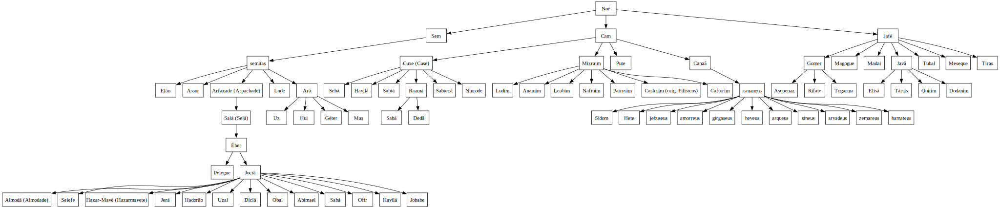

# Os Descendentes de Noah
Este repositório visa dois objetivos. O primeiro é demonstrar a possibilidade de construção de árvores genealógicas por meio da linguagem DOT. E o segundo é, obviamente, expor a descendência de Noé segundo a Bíblia (ARC).

